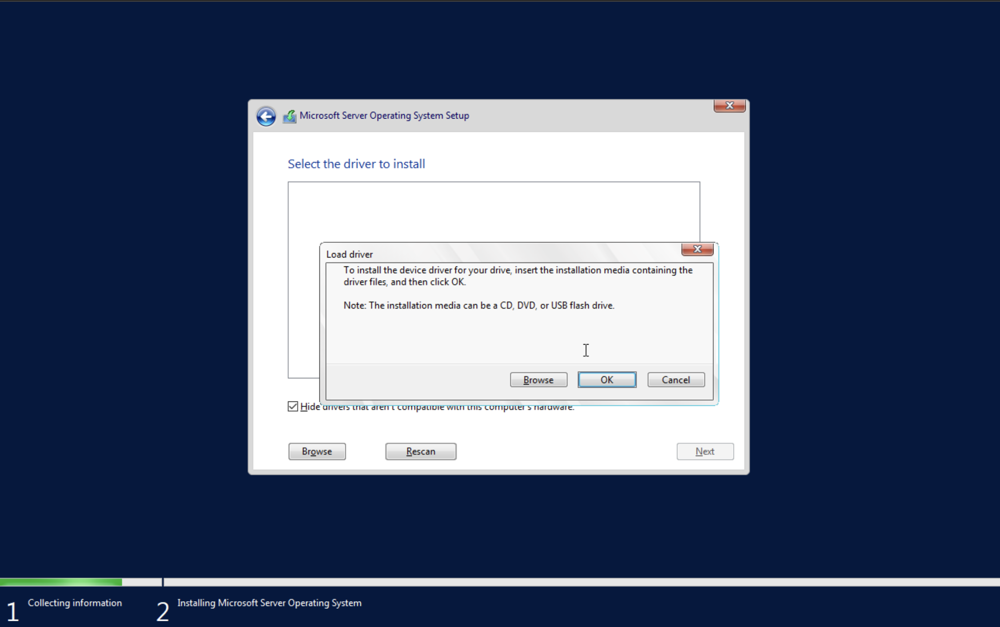

# Install and configure Proxmox VE. Windows Server 2022 and Windows 11 Client installations.

This document explains the setup and configuration of virtualized Proxmox environment, with Windows Server 2022 and Windows 11 client installations.

## Objectives

- Setup and configure Type 1 Hypervisor (Proxmox VE).
- Install and configure Windows Server 2022 in a virtualized environment.
- Deploy a Windows 11 client to interact with the server environment.
- Create a foundation for further experiments involving Active Directory, system administration, and IT operations.

## Prerequisites

- A physical server or machine with sufficient resources (In my case, ThinkPad T480)
- USB drive (8 GB)
- Switch
- Proxmox VE ISO
- Windows Server 2022 ISO
- Windows 11 ISO
- Basic knowledge of virtualization, networking, and Windows administration

## Issues

- [Active Directory Breaks When Using NAT](https://github.com/azavtyr/notes/blob/main/Active%20Directory%20Breaks%20When%20Using%20NAT.md)

## Documenting

### 1. Install Proxmox VE

1. Follow the official Proxmox installation guide: [Proxmox Docs](https://pve.proxmox.com/pve-docs/chapter-pve-installation.html)
2. Upload Win Server and Win 11 ISOs.

#### Required VirtIO drivers for Windows machines on Proxmox

When installing Windows on Proxmox, you must load VirtIO drivers during setup in order the system to recognize hard drives, NIC, etc.

- Follow this official Proxmox Windows installation guide: [Windows Installation Guide](https://pve.proxmox.com/wiki/Windows_10_guest_best_practices)

### 2. Install Windows Server 2022

1. **Create a Virtual Machine**:

  - In Proxmox UI click "Create VM".
    - Configure:
	    - Add additional drive for VirtIO drivers and pick downloaded VirtIO ISO.
	    - Enable QEMU Guest Agent
      - CPU: `2+` cores
      - RAM: `4GB+`
      - Storage: `55GB+`

2. **Install Windows Server**:

  - Start the VM and follow the Windows Server installation wizard.
  - Choose "Windows Server 2022 Standard (Desktop Experience)" for GUI-based management.
  - Load SCSI driver.
  - Configure the administrator password and complete the installation.

### 3. Install Windows 11 Client

1. **Create a Windows 11 VM**:

  - Create a new VM and configure:
    - Add additional drive for VirtIO drivers and pick downloaded VirtIO ISO.
	  - Enable QEMU Guest Agent
    - CPU: `2+` cores
    - RAM: `4GB+`
    - Storage: `55GB+`

2. **Install Windows 11**:

  - **Important:** Windows Home Edition does not support joining Active Directory domains. Use Pro, Education or Enterprise editions instead.
  - Start the VM and follow the Windows 11 installation wizard.
  - Load SCSI driver.
  - Configure the user account and complete the setup.

